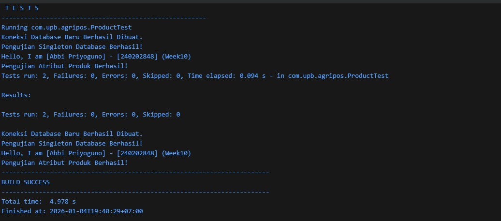

# Laporan Praktikum Minggu 1 (sesuaikan minggu ke berapa?)
Topik: [Tuliskan judul topik, misalnya "Class dan Object"]

## Identitas
- Nama  : [Abbi Priyoguno]
- NIM   : [240202848]
- Kelas : [3IKRB]

---

## Tujuan
(
1. Mahasiswa mampu mengimplementasikan Singleton Pattern untuk menjamin satu instance akses global.

2. Mahasiswa memahami pemisahan tanggung jawab kode menggunakan arsitektur MVC (Model-View-Controller).

3. Mahasiswa mampu melakukan pengujian kode secara mandiri menggunakan framework JUnit.

4. Mahasiswa mampu menganalisis pengaruh penerapan pola desain terhadap kemudahan pemeliharaan kode..*)

---

## Dasar Teori
(
1. Design Pattern: Solusi standar untuk masalah umum dalam desain perangkat lunak yang berfungsi sebagai template kode yang dapat digunakan kembali.

2. Singleton Pattern: Pola desain yang membatasi instansiasi class menjadi satu objek saja. Hal ini penting untuk mengelola resource bersama seperti koneksi database.

3. MVC (Model-View-Controller): Pola arsitektur yang memisahkan data (Model), tampilan pengguna (View), dan logika kontrol (Controller) untuk mempermudah pengembangan sistem yang kompleks.
)

---

## Langkah Praktikum
(
1. Implementasi Singleton: Membuat class DatabaseConnection di paket config dengan constructor private.

2. Implementasi MVC: - Membuat Product.java sebagai representasi data (Model).

 Membuat ConsoleView.java untuk menangani output teks (View).

 Membuat ProductController.java sebagai pengatur logika antar Model dan View (Controller).

3. Unit Testing: Membuat file ProductTest.java pada folder src/test dan menulis skenario pengujian menggunakan anotasi @Test.

4. Eksekusi: Menjalankan AppMVC.java dan menjalankan JUnit Test Runner untuk memverifikasi kebenaran kode.
.)

---

## Kode Program
(Tuliskan kode utama yang dibuat, contoh:  

```java
// Contoh
Produk p1 = new Produk("BNH-001", "Benih Padi", 25000, 100);
System.out.println(p1.getNama());
```
)
---

## Hasil Eksekusi
(Sertakan screenshot hasil eksekusi program.  


)
---

## Analisis
(
1. Analisis Kode: Program menggunakan Singleton pada DatabaseConnection untuk memastikan efisiensi memori, di mana objek koneksi hanya dibuat satu kali. Pada struktur MVC, jika ada perubahan pada cara menampilkan data (misalnya ingin mengubah tampilan ke GUI), kita hanya perlu mengubah class View tanpa menyentuh logika bisnis di Model.

2. Perbedaan Pendekatan: Dibanding minggu sebelumnya, struktur kode kini lebih rapi karena dibagi ke dalam paket-paket fungsional (model, view, controller, config). Penggunaan JUnit memungkinkan deteksi bug secara otomatis tanpa harus menjalankan program utama berkali-kali secara manual.

3. Kendala dan Solusi: Kendala yang sering muncul adalah konfigurasi classpath untuk JUnit 5. Solusinya adalah memastikan dependensi JUnit sudah terpasang dengan benar di IDE (seperti IntelliJ atau Eclipse).
)
---

## Kesimpulan
(
Penerapan Design Pattern (Singleton & MVC) membuat aplikasi Agri-POS lebih modular, terorganisir, dan mudah dikembangkan (extensible). Ditambah dengan Unit Testing, kualitas perangkat lunak menjadi lebih terjamin karena setiap perubahan kode dapat langsung diuji validitasnya.*)

---

## Quiz
(
1. Mengapa constructor pada Singleton harus bersifat private? Jawaban: Agar class tersebut tidak dapat di-instansiasi (dibuat objeknya) secara bebas dari luar class menggunakan kata kunci new. Hal ini menjamin bahwa satu-satunya cara mendapatkan objek adalah melalui method getInstance().

2. Jelaskan manfaat pemisahan Model, View, dan Controller. Jawaban: Mempermudah kolaborasi (misal: desainer fokus di View, programmer di Model), meningkatkan reusability (satu Model bisa digunakan oleh banyak View), dan mempermudah pengujian serta pemeliharaan kode secara terpisah.

3. Apa peran unit testing dalam menjaga kualitas perangkat lunak? Jawaban: Berperan sebagai jaring pengaman (safety net) untuk mendeteksi kesalahan logika sejak dini, memastikan setiap fungsi berjalan sesuai spesifikasi, dan mencegah regression bug saat ada penambahan fitur baru.

4. Apa risiko jika Singleton tidak diimplementasikan dengan benar? Jawaban: Bisa terjadi pembuatan objek ganda (multiple instances) yang menyebabkan pemborosan resource (memori/koneksi), ketidakkonsistenan data global, atau race condition pada aplikasi multi-threading.
 )
